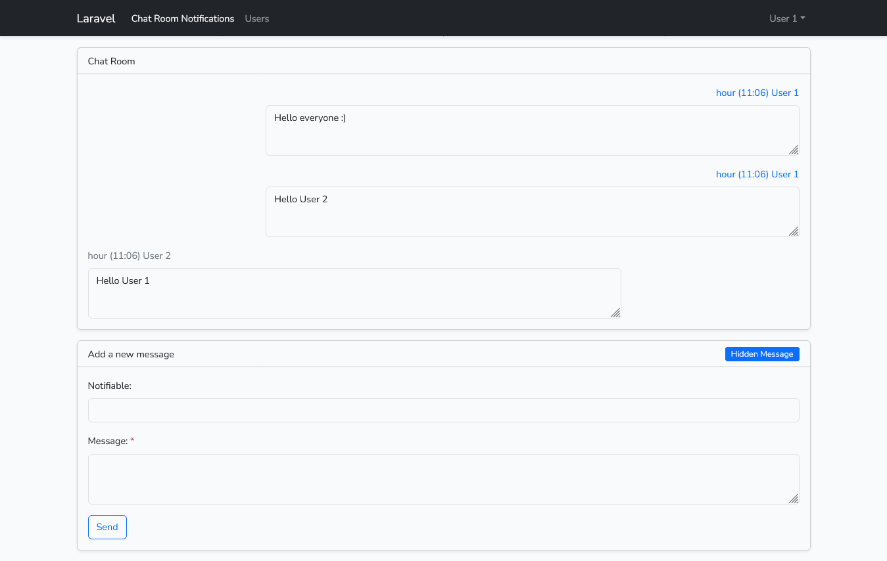

## Laravel chat room (Inertia.js, Vue 3) (Current: Laravel 10.*)

Laravel chat room (Inertia.js, Vue 3) is a realtime chat room basically based on the Laravel 10, Inertia.js, Vue 3, Bootstrap 5 and DataTables.

## Setup

Clone the repo and follow below steps.
1. Run `composer install`
2. Copy `.env.example` to `.env`
3. Set valid database credentials of env variables `DB_DATABASE`, `DB_USERNAME`, and `DB_PASSWORD`
4. Run `php artisan key:generate` to generate application key
5. Run `php artisan migrate`
6. Run `php artisan websockets:serve` to start websockets,
7. Run `npm i` (Recommended node version `>= V18.16.0`)
8. Run `npm run dev` or `npm run build` as per your environment

## License

The Laravel framework is open-sourced software licensed under the [MIT license](https://opensource.org/licenses/MIT).

## ScreenShots

## Chat Room notifications - User 1

## Chat Room notifications - User 2

## List Users

